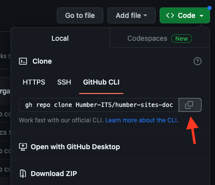

# Humber Websites Docs

This repository houses the documentation for multiple Humber ITS Websites: 

* its-site
* its-cab
* its-gallery

These docs are built using [MkDocs](https://www.mkdocs.org/) and the [Material Theme](https://squidfunk.github.io/mkdocs-material/). MkDocs is a static site generator that converts markdown files into beautiful documentation and makes the process of creating documentation very quick and easy.  

## Updating the Docs

In order to make changes, it is recommended to clone and setup the project locally. 

### Cloning Repository

#### Requirements

* Github CLI or Git

#### Steps

<ol>
    <li>Click the <code><> Code</code> button and select <code>GitHub CLI</code>, then click the <strong>copy</strong> button.</li>
    </img>
    <li><code>cd</code> into the directory where you want to clone this project using Terminal.</li>
    <li>Paste and run the command you copied in step 1.</li>
</ol>

### Local Setup

These steps are for first time setup after cloning this repository. 

#### Requirements

* Cloned Repository (See above)
* Python 3 (3.11.4 or later recommended)
* Pip3

#### Steps

**Note:** The following instructions are applicable on Mac and Linux, so Windows users may need to look up how to create and activate a virtual environment. You also may need to use `python` and `pip` instead of `python3` and `pip3`. This depends on your local setup and how the binaries were added to your path during Python setup. 

<ol>
    <li><code>cd</code> into the newly cloned repository using Terminal.</li>
    <li>Create a virtual environment using the command:</li>
    <code>python3 -m venv venv</code>
    <li>Activate the virtual environment using the command:</li>
    <code>venv/bin/activate</code>
    
If this is done correctly, you should see <code>(venv)</code> in the Terminal.

    <li>Install the requirements using the command:</li>
    <code>pip3 install -r requirements.txt</code>
    
The project should now be installed and ready to use.

</ol>

### Usage

#### Requirements

* Project Cloned and Setup
* Virtual Environment must be active

#### Serve

MkDocs can generate a local development version of the documentation site. Use the command `mkdocs serve` to create a local development version which updates as you make changes. This will output a local URL which you can open in browser to see the docs:

`Serving on http://127.0.0.1:8000/`

#### Build

MkDocs can also build the production version of the documentation site. Use the command `mkdocs build` to build the production version. This will update the `site/` directory with the files and assets needed to open the site on the production server. 

### Pushing Updates

It is recommended to use Git and Git-flow when pushing changes to the documentation. All development should take place on the `develop` branch. When building a new section of the documentation, please checkout the Develop branch before creating a new branch called `feature/descriptive-name`. The completed changes can be merged back into `develop` where they can be either tested or combined with other changes. If the `develop` branch is tested and working properly, the changes can finally be merged into `main`.

This will ensure that changes are compartmentalized and can be easily reversed in case of any issues. 
