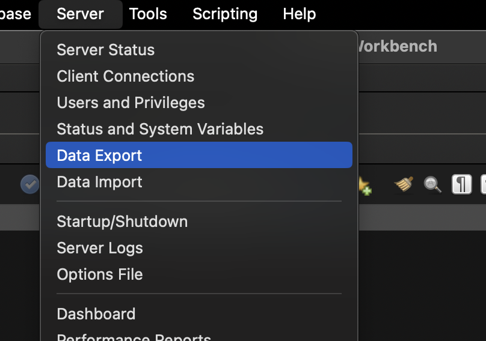
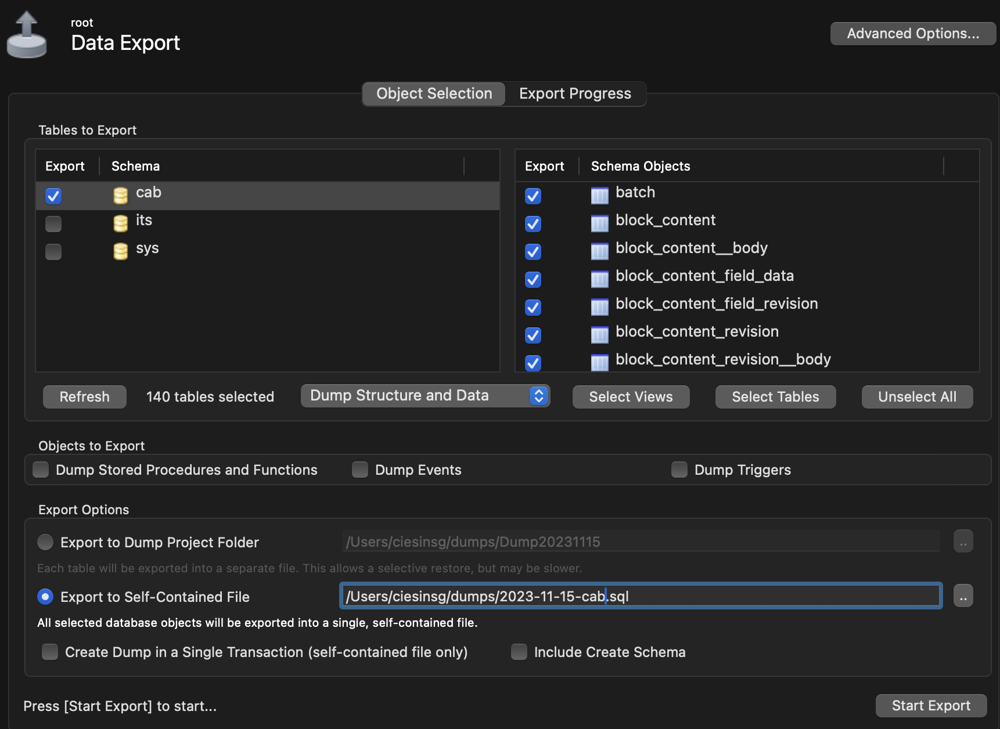

# Backup and Restore

## Site Maintenance

The Site Maintenance message informs regular users the site is under maintenance. Authorized users can maintain the site and update content during this time. 

[Enabling and Disabling Maintenance Mode](https://www.drupal.org/docs/user_guide/en/extend-maintenance.html)

## Version Control

The source code is backed up using [Git](./developer-tools.md#git). This creates snapshots of the site throughout development. For example, if the Drupal theme needs to be modified, you may branch off from the `develop` branch to create a `feature/detailed-name` branch using Git, and make your changes there. In the event something goes wrong and the theme completely breaks, you can simply checkout the `develop` branch to return to a working version.

**Note:** this is not a complete back-up of the site, but is instead used to create snapshots of the site throughout development. To see how to create a backup, read the [Backups](#backups) section below.

### Gitignore

A gitignore is used to ensure sensitive files or unneeded files are not backed up using version control. For example, the `settings.php` file contains sensitive information including the database connection information, and should be backed up separately. For this reason it is included on the `.gitignore` so that it is ignored by Git. 

Learn more about [Setting up the .gitignore file](https://www.drupal.org/docs/user_guide/en/extend-git.html). 

## Backups

It is important to back up the website frequently to prevent data loss. A backup consists of the site's source code, and a MySQL dump of the database. 

While GIT version control is very useful for development, Drupal sites are very closely tied to the database, so using a snapshot that relies on different tables than exist in the database can lead to numerous site errors. For this reason, it is recommended to create a Tar backup of the site root, and corresponding SQL dump that is stored with the site root backup. During the restore process, both parts of the site can be restored without worrying about a version or table mismatch. 

It is recommended to backup frequently to avoid data loss, as well as before carrying out any of the below processes:

* Updating or Upgrading
* Migrating, copying, moving, or replacing files or the whole site
* When there has been significant content added

Backups should also be tested periodically to ensure it is possible to restore the site from the backups.

### Backup Conventions

In order to stay consistent, backups should be placed into separate folders for each site. 

Each separate backup should be placed in its own folder with the name <code>YYYY-MM-DD version</code>.

This folder should contain the MySQL dump, and the source code for the site.

```title="Folder Structure"
/cab backups                    # Contains all cab backups
    /2023-11-14 v0.0.1          # Contains specific backup files
        2023-11-14-cab.sql      # MySQL dump
        cab.tar.gz              # Site root folder (source code)
```

```title="Version Name"
0.0.x   # PATCH contains bug fixes, or small changes
0.x.0   # MINOR change contains new features or branch merges
x.0.0   # Major version signifies public release state

/*
Note on release state: 

The major version 0 is for unreleased development versions of the site. Once the site is released, the version changes to 1. If enough minor changes and patches occur, the major version can change with the next push to production. 
*/
```

### Creating a Full Backup

Creating a full backup is a multi-step process:

[Turn off Cron Jobs](#turn-off-cron-jobs)

[Clear Cache](#clear-cache)

[Loosen Permissions](#loosen-permissions)

[Backup Site Files](#backup-site-files)

[Backup Database](#backup-database)

[Turn on Cron Jobs](#turn-on-cron-jobs)

[Harden permissions](#harden-permissions)

**Note:**  

#### Turn off Cron Jobs

It is highly recommended to turn off CRON jobs before making a Full Backup as the CRON jobs can be resource intensive. 

1. Select <code>Configuration</code> > <code>System</code> > <code>CRON</code> within the Admin toolbar.

{ width="400" }

2. Change **Run cron every** to **Never**.

{ width="500" }

#### Clear Cache

It is a good practice to clear or rebuild caches when moving a site from one host to another. This can also be useful when installing new modules or themes as it is often a first step in troubleshooting. It is recommended to clear the cache frequently throughout development. 

**Note:** Sites may slow down a bit after being cleared as the cache slowly fills back up. This is a normal side-effect of clearing the cache. 

##### Clearing Cache using Drush

The quickest and easiest way to clear the cache is to use Drush. The steps to do this are described in [Developer-tools/Drush](developer-tools.md#clear-cache).

##### Steps to Clear Cache Manually

1. Select <code>Configuration</code> > <code>Development</code> > <code>Performance</code> within the Admin toolbar.

{ width="400" }

2. Click **Clear all caches**.

{ width="400" }

#### Loosen Permissions

The Drupal installation contains protected files and directories that make it difficult to back-up the site or to make changes. It is recommended to loosen these files before zipping the source code, or the protected files and folders may be missing from the backup. 

`project/web/sites/default` is a protected directory that contains the site config files. By default, the permissions for this folder are 555. Use [chmod](developer-tools.md#chmod) to change the permissions to 777.

`project/web/sites/default/settings.php` is the main config file for the site. By default, the permissions for this folder are 444. Use [chmod](developer-tools.md#chmod) to change the permissions to 777.

#### Backup Site Files

The source code can be backed up using the CLI:

1. You can [use tar](developer-tools.md#gzip--tar) to back up the entire root folder. 

```title="Zip project directory using tar"
tar -czvf YYYY-MM-DD-project.tar.gz cab

# Replace the YYYY-MM-DD with the date, and project with the project name
```

2. Move the resulting file into the backup folder described in [Backup Conventions](#backup-conventions).

#### Backup Database

The database can be backed up using MySQLWorkbench. To back up the database:

1. Open the MySQLWorkbench app and connect to the database.
2. In the menu, click `Server` > `Data Export`.

{ width="400" }

3. Under "Tables to Export" checkmark the database name. Under "Export Options" select **Export to Self-Contained File**

{ width="600" }

4. In the space beside **Export to Self-Contained File**, feel free to change the directory, and rename the file as per [Backup Conventions](#backup-conventions). Then click Start Export.

5. Move the resulting file into the backup folder described in [Backup Conventions](#backup-conventions).

**IMPORTANT:** The database, tables, and columns being exported must be set to the correct [collation](database.md#collation) or the import will fail. In the event that the import fails, follow the steps to fix collation, and then export the data once again. 

#### Turn on Cron Jobs

Once the database has been backed up, Cron jobs can and should be enabled once again. To do this, simply repeat the steps to [Turn off Cron Jobs](#turn-off-cron-jobs) but instead, change **Run cron every** to **3 hours**.

#### Harden permissions

Once the backup is created, you can once again harden the permissions using [chmod](developer-tools.md#chmod).

Change the `project/web/sites/default` directory to permissions 555, and the `project/web/sites/default/settings.php` file to permissions 444. 

### Testing Backups

Backups, especially for the production site, should be tested before making any changes. This can be done with the below process. 

1. Create a backup database schema and give your local user the required privileges to use it.
2. Import the database dump you created in [Backup Database](#backup-database).
3. Create a new directory for the backup site and create a [vhosts](developer-tools.md#configuring-virtual-hosts) and [hosts](developer-tools.md#defining-a-new-host) entry so the directory is accessible in your browser.
4. Extract the backup you created into this directory. 
5. Modify your settings.php. You will need to add the URL you created in vhosts and hosts to your trusted hosts configuration, and you will need to alter the database connection information to match the backup database you created in step 1. Be mindful of any spelling errors or missed commas/apostrophes in the trusted hosts array.
6. Attempt to access this URL. 

**Note:** If you have configured SAML, you may get a "Too many redirects" error. In that case, access your URL with `/user' at the end to bypass the SAML login page, and go straight to the built in login page for the site. You can login as any user you allowed to login without using SAML. 

## Restore

Once a backup is created, it can be used to restore the website or to create a new installation of the site. This can be useful to create a development site or production site. 

There are more steps required when using the backups to migrate the site, or to create a staging or production version of the site. 

### Restoring a Site

These instructions assume that you are restoring a site with an existing Apache configuration. 

As with [creating a backup](#backups), restoring a site is also a multi-step process: 

#### Unzip Source Code

Unzip the contents of the `project.tar.gz` file into the site directory configured in Apache. If there are existing files in this directory, ensure that you delete them first, including hidden files. 

If unzipping the zip file creates a new subdirectory, move the contents of this subdirectory out into the root directory. 

#### Restore Database

In order to restore the database, it is first necessary to drop existing tables: 

1. [Drop tables](database.md#drop-database-tables) in the outdated database. 

2. Using MySQLWorkbench, go to the menu and click `server` > `Data Import`.

3. Under **Import Options**, select **Import from Self-Contained File** and select the backup file. Under **Default Schema to be Imported To** select the existing database from the dropdown. Then click Start Import.

## Migrating Site

In order to migrate a site to the staging server or live server, the steps to create a [backup](#backups) are the same. 

The main difference is that the Apache server on those environments will need to be configured, and the config file will need to be changed.

### Apache Server Configuration

The Apache Server is configured by the server team. As the staging and production servers are essentially clones of the local server, the Apache Server needs to point at the `project/web` directory, and not at the project root.

### Changing settings.php

The `settings.php` file must be slightly changed in order to work on the staging and live servers. 

#### Trusted_host

Depending on whether the site is being hosted on the staging or production servers, the correct URL must be defined in [trusted_host](drupal-sites.md#trusted-host) or the site will display an error and will not work.

#### Database

The local environment, staging environment, and production environments should each have their own separate databases. This is defined in the bottom of the settings.php file in [databases](drupal-sites.md#change-the-database-connection).
