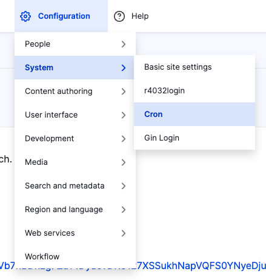
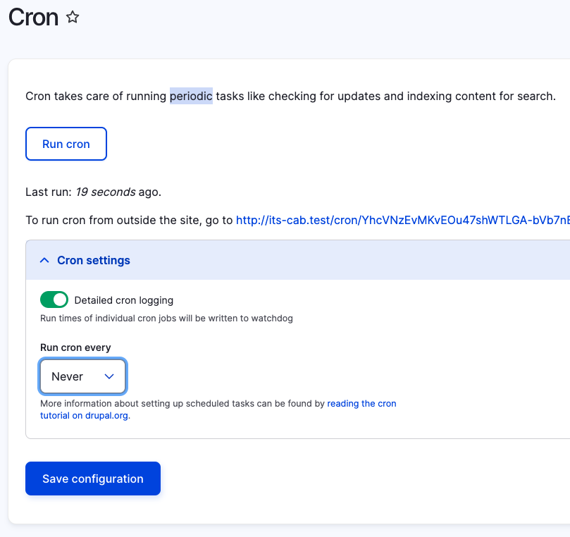
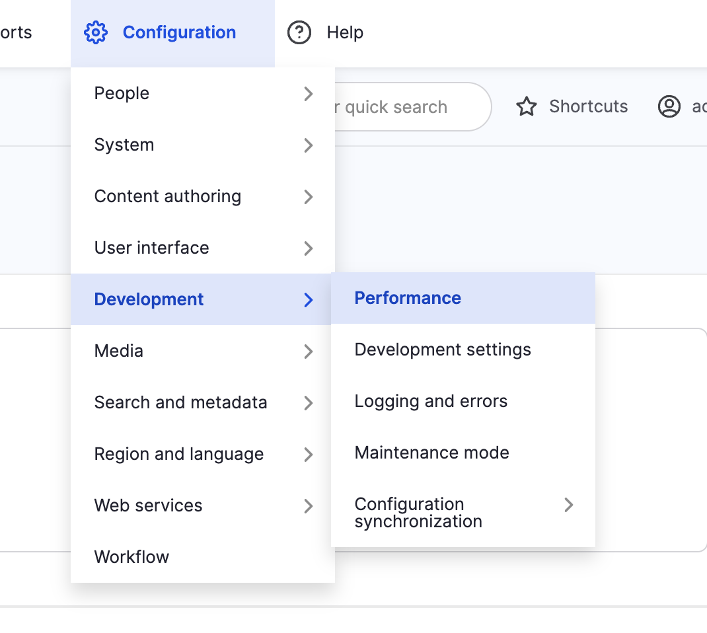
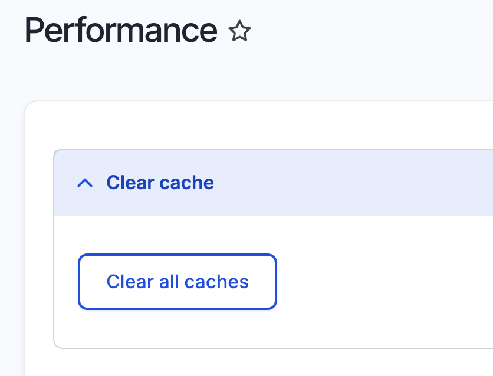

# Backup and Restore

## Site Maintenance

Presents message that the site is under maintenance to users who do not have the right permissions. Authorized users can maintain the site and update content during this time. 

[Enabling and Disabling Maintenance Mode](https://www.drupal.org/docs/user_guide/en/extend-maintenance.html)

## Backups

It is important to back up the website frequently to prevent data loss.

It is an especially good idea to carry out a full backup when:

* Updating or Upgrading
* Migrating, copying, moving, or replacing files or the whole site
* When there has been significant content added

Backups should also be tested periodically to ensure it is possible to restore the site from the backups.

### Backup Naming Conventions

As there will be many backups, it is important to follow a naming convention that includes the date of the backup. For the purpose of consistency, I will be using the below format to name the backups:

<code>yyyy.mm.dd-site-name</code>

This convention will be used in the later steps during the creation of the backups where a clearer example is shown.

### Creating a Full Backup

Creating a full backup is a multi-step process:

1. [Turn off Cron Jobs](#turn-off-cron-jobs)
2. [Clear Cache](#clear-cache)
3. [Back up Site Files](#backup-site-files)
4. [Back up Database](#backup-database)

#### Turn off Cron Jobs

It is highly recommended to turn off CRON jobs before making a Full Backup as the CRON jobs can be resource intensive. 

##### Steps to Turn off Cron Jobs

1. Select <code>Configuration</code> > <code>System</code> > <code>CRON</code> within the Admin toolbar.

{ width="400" }

2. Change **Run cron every** to **Never**.

{ width="500" }

#### Clear Cache

It is a good practice to clear or rebuild caches when moving a site from one host to another. This can also be useful when installing new modules or themes as it is often a first step in troubleshooting. It is recommended to clear the cache frequently throughout development. 

**Note:** Sites may slow down a bit after being cleare as they slowly fill back up. This is a normal side-effect of clearing the cache. 

##### Clearing Cache using Drush

The quickest and easiest way to clear the cache is to use Drush. The steps to do this are described in [Developer-tools/Drush](developer-tools.md#clear-cache).

##### Steps to Clear Cache Manually

1. Select <code>Configuration</code> > <code>Development</code> > <code>Performance</code> within the Admin toolbar.

{ width="400" }

2. Click **Clear all caches**.

{ width="400" }

#### Backup Site Files

Once the CRON jobs have been disabled and the caches are cleared, you can back up the entire [root folder](glossary.md#root-folder). 

**Note:** The following instructions are based on a folder structure where Repositories and Backups are sibling folders in the Documents parent directory. Depending on your directory structure, the paths may need to be modified in the below commands.

```
.
└── Documents/
    ├── Repositories/
    │   ├── its-cab
    │   └── its-site
    └── Backups/
        ├── its-cab
        └── its-site
```

##### Steps to backup root files 

1. Open Terminal and navigate to your Backups folder.

```shell title="Navigate to your backup directory"
cd Documents/Backups/its-cab
```

2. Compress the Drupal Site directory ensuring you follow the [Backup Naming Conventions](#backup-naming-conventions).

```shell title="Compress the directory using tar"
tar czf 2023.08.04-its-cab.tgz ../../Repositories/its-cab 
```

#### Backup Database

[Concept: Data Backups](https://www.drupal.org/docs/user_guide/en/prevent-backups.html)
[Back up your site using the command-line](https://www.drupal.org/docs/7/backing-up-and-migrating-a-site/back-up-your-site-using-the-command-line)

## Development Site

It is not recommended to carry out core and module updates on the live/production version of the site because it could introduce breaking changes that are difficult to reverse. It may also result in an unexpected outage. Instead, it is recommended to set up a local development site which is essentially a clone of the live/production server. The process of setting up a local development site can also be used to verify the integrity of the backup files. 

This development site is used for updates and major changes as well as for testing. Once the testing is complete, the changes can be pushed to the live site. 

[Making a Development Site](https://www.drupal.org/docs/user_guide/en/install-dev-making.html)

## Restore

This section is about restoring the website from a backup.

## Pushing Website

This section focuses on pushing the website to the staging server. 

### Using Rsync to Transfer Website

Rsync is a command-line utility used to transfer files and directories. It can also be used over SSH making it ideal to transfer the site via SSH. 

#### Pushing from Local to Staging

### Removing Website from Staging

**Warning:** This action is very dangerous and should be used carefully. It should not be used in production without reaching out to the lead developer as it first grants ALL linux permissions to all users and groups, and then deletes the directory and its contents. It should only be done if there is a significant enough issue to purge the directory and reupload it.

1. Use Terminal to cd into the Staging directory. 

2. Grant 777 permissions to the directory and its contents. This step is required as certain Drupal files are setup with limited permissions and prevent recursive removal if the permissions aren't changed.

```shell title="Grant 777 permissions to directory recursively"
chmod -R 777 its-cab
```

3. Remove the directory and its contents recursively. 

```shell
rm -rf its-cab
```