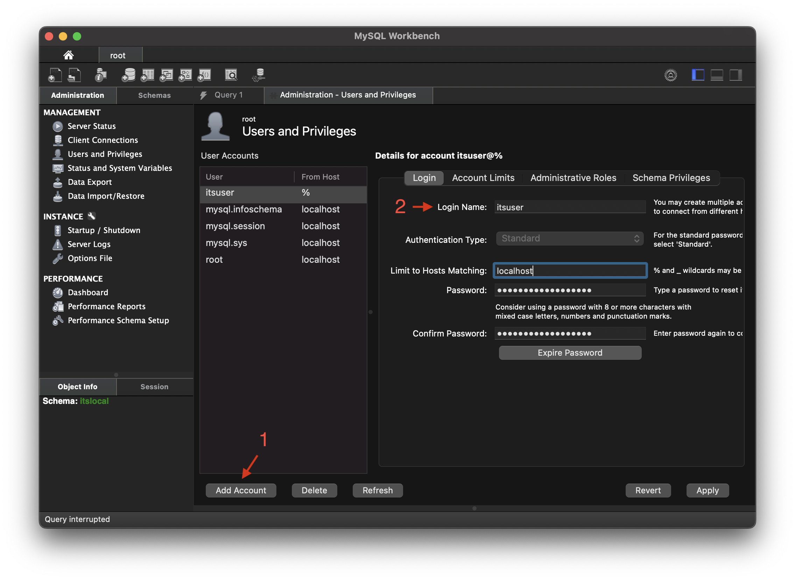

## MySQL

MySQL is the main database used in the Humber development and production environments. This section outlines some common use cases.

### Installation

You need to install two tools to use MySQL locally. 

1. MySQL Workbench

The [MySQL Workbench](https://dev.mysql.com/downloads/workbench/) is the software used to connect to the MySQL database. 

2. MySQL Community Server `8.0.xx`

The [MySQL Community Server](https://dev.mysql.com/downloads/mysql/) is the actual MySQL server you need to run locally. The MySQL Workbench can connect to this server. Currently, MySQL Workbench can only connect to MySQL Community Server `5.7.xx` or `8.0.xx`, so make sure you download an 8.0.xx version. 

### Server Setup

The following instructions are for setup on Mac. 

#### Add Root Connection

The root connection will be used to connect to the local server and write queries. This can be later used to create new users and databases.

1. Install the downloaded MySQL Community Server `8.0.xx`. During the installation it will ask you to set a password. Use the default password option and not legacy. Type in your password carefully as the software will not ask you to verify the password. 
2. Open System Settings and scroll to the bottom in the left panel. Select MySQL. In the right side of the window, click Initialize database and enter your password. Once this is complete, click "Start MySQL Server".

3. Open MySQL Workbench and click the + button.

4. Fill in the connection information as per below:

1. Click "Test Connection". This should prompt a popup asking for your password. Fill it in, making sure to checkmark "Save Password" and click OK. 

1. If you see the below window, the connection is successful. In the Setup New Connection screen, you can now click OK and the connection will be saved. 


### Create New Database

Each local website requires a unique user and schema. In MySQL the schema is synomymous with database. The website is configured to use the created user to access the database. 

Learn more about [Creating a New Database](https://git.drupalcode.org/project/drupal/-/blob/10.1.x/core/INSTALL.mysql.txt).

#### Create User

1. Connect to the root database which was setup in [Add Root Connection](#add-root-connection). 
2. Click Users and Privileges in the left side menu.

3. Click Create User, and then fill out the username and password.

4. Click Apply to save the new user.

**Note:** Make sure you set the host to localhost in order for the later steps to work.

#### Create Schema

1. Connect to the root database which was setup in [Add Root Connection](#add-root-connection). 
2. Click the Create New Schema button on the top toolbar.

3. Name the new database, then select the Character Set `utf8mb4` and the Collation `utf8mb4_unicode_ci`. Click Apply, then Apply once again. 


#### Grant User Access to Schema

1. Connect to the root database which was setup in [Add Root Connection](#add-root-connection). 
2. In the Query tab, type the following SQL command where `its` is replaced by the database, and `itsuser`@localhost is replaced by the username.

```
GRANT SELECT, INSERT, UPDATE, DELETE, CREATE, DROP, INDEX, ALTER, CREATE TEMPORARY TABLES
ON its.*
TO 'itsuser'@'localhost';
```

3. Click CMD+Enter on Mac or Ctrl+Enter on Windows to run the query.

### Exporting & Importing MySQL dump

A database can be backed up by exporting it to a `.sql` dump file. This can later be used during [first deployment](development-environments.md#first-deployment) or to restore a website that has become corrupt or lost data.

#### Exporting data

1. Connect to the database you are exporting.
2. Click Server > Data Export. 
3. Checkmark the name of the database, and select "Export to Self-Contained File" in the **Export Options**. 
4. Click Start Export, and the database should export to a file similar to `date.sql`. 

**Note:** Ensure that you [fix collation](#fixing-collation) before you attempt to import this into the staging environment running an older version of SQL. 

#### Importing data

1. Connect to the database you want to import the data into.
2. Click Server > Data Import.
3. Select "Import from a Self-Contained File" in Import Options, and then select the dump file created above. 
4. Select the name of the database in **Default Schema to be Imported To**. 
5. Click Start Import. The import process should output a success message. If it outputs an error instead, read below. 

##### Error 1273

During the import process, you may experience an error similar to: 

```
ERROR 1273 (HY000) at line 25: Unknown collation: 'utf8mb4_0900_ai_ci'

Operation failed with exitcode 1
17:46:09 Import of /Users/ciesinsg/Documents/Backups/2023-11-07-backup.sql has finished with 1 errors
```

This indicates that the database, and/or one or more tables & columns may be using the wrong collation. This is due to a version mismatch between the exported database and the imported one. In this case, the exported database is MySQL version 8, while the importing database is MySQL version 5.7, and does not recognize 'utf8mb4_0900_ai_ci'. To correct this, it is necessary to fix the database, tables, and column [collation](#collation), and then export it once again. If this is done correctly, the database should import successfully. 

### Collation

Collation determines how strings are sorted in the database, including case, and diacritics. When a database is exported from SQL 8, it needs to be fixed before it can be imported into SQL 5.7. 

#### Fixing Collation

1. If no MySQL dump exists yet, create one by following the steps in [Importing Data](#importing-data). This should result in a `dump-name.sql` file. 
2. Create a copy of this file, and rename it `dump-name-57.sql` so that two SQL dumps exist. The original will be for SQL 8, while the duplicate will be for SQL 5.7
3. Run SED on the sql dump to replace the unrecognized collation with one that SQL 5.7 understands. It is necessary to run SED twice in order to replace both the collation and the charset: 

```title="Using SED to fix collation"
# Fix Collation
sed -i '' s/utf8mb4_0900_ai_ci/utf8_general_ci/g dump-name-57.sql

# Fix Charset
sed -i '' s/utf8mb4/utf8/g dump-name-57.sql
```

**Note:** Ensure you only run the SED commands on the `57` dump so that the original dump remains unchanged.

**Note:** SED replaces one string of text with another. In a MySQL dump file, this alters the collation defined in multiple parts of the file. 

### Useful Queries

#### Check SQL Version

```sql title="Simple version check"
SELECT VERSION();
```

```sql title="Detailed version check"
SHOW VARIABLES LIKE "%version%"
```

#### Drop Database Tables

To drop the database tables, first run this script to generate SQL drop queries:

```sql
SELECT CONCAT('DROP TABLE IF EXISTS `', table_name, '`;')
FROM information_schema.tables
WHERE table_schema = 'database_name';
```

After running this script, copy the outputted queries without quotations and 
run them to delete the tables.
