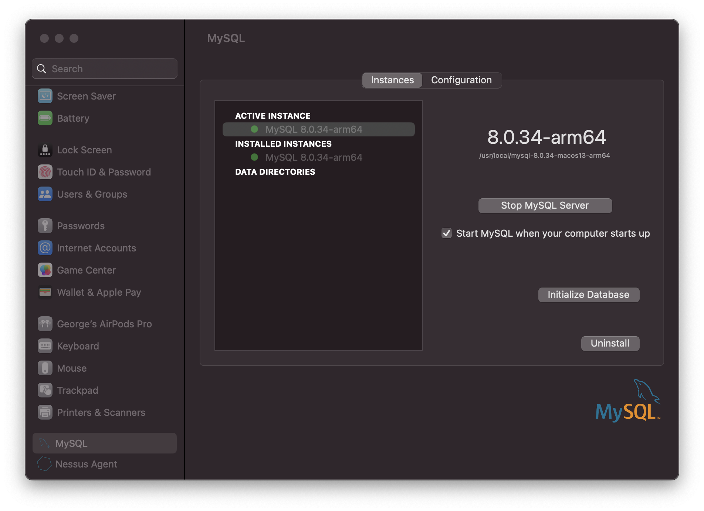
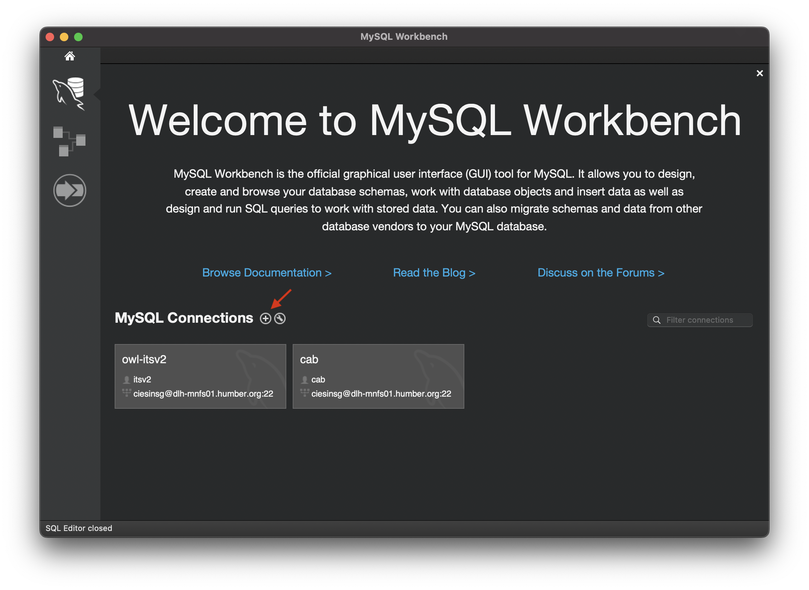
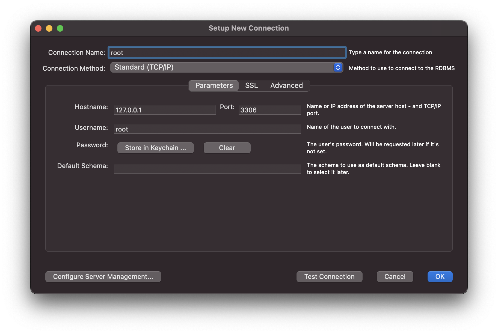
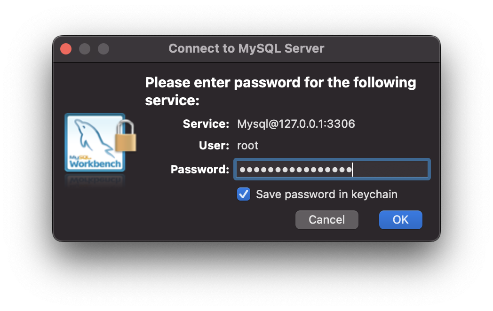
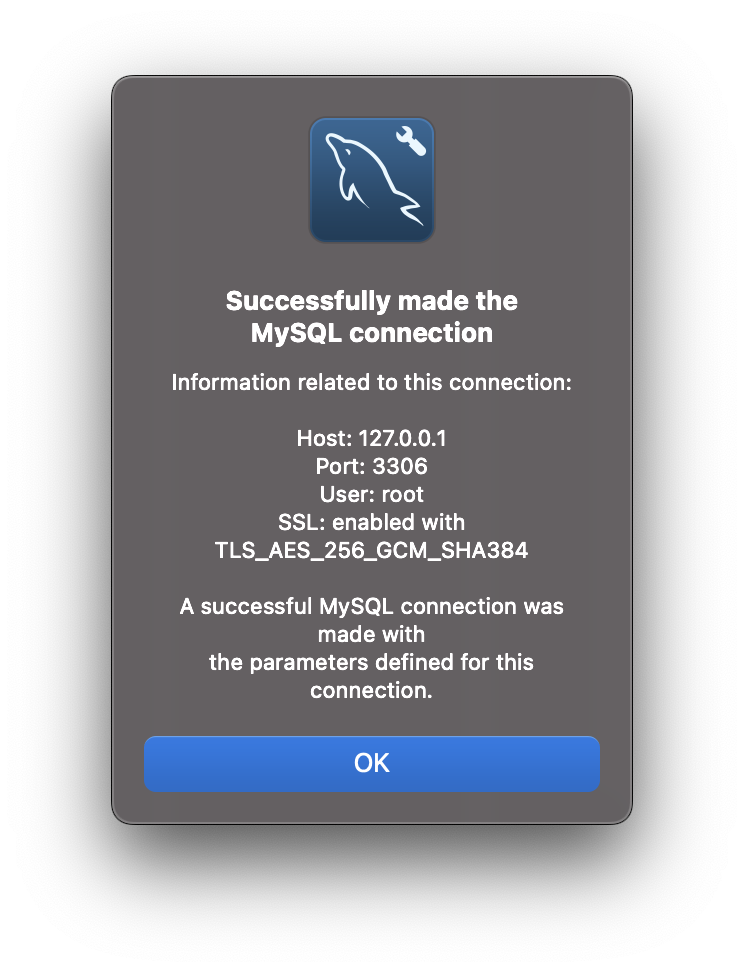
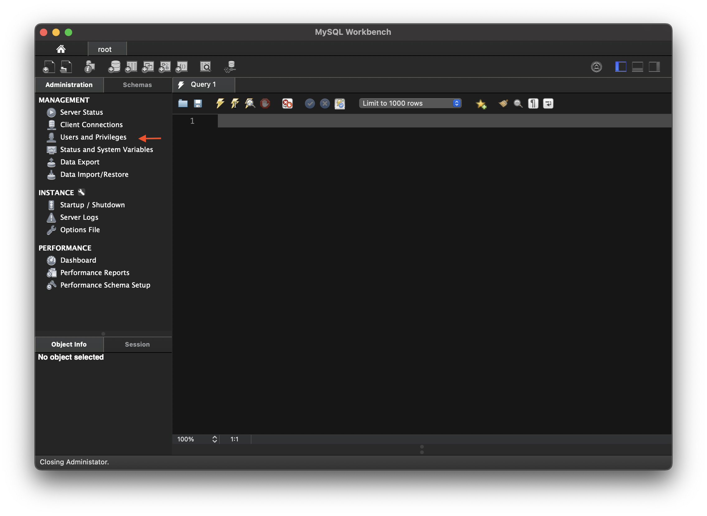
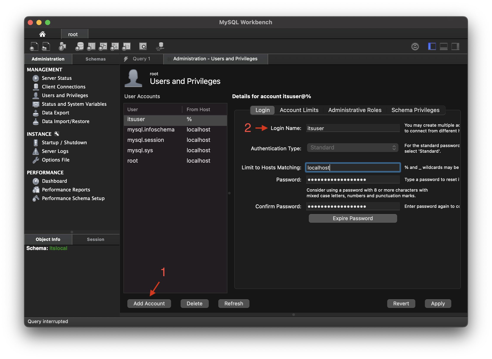
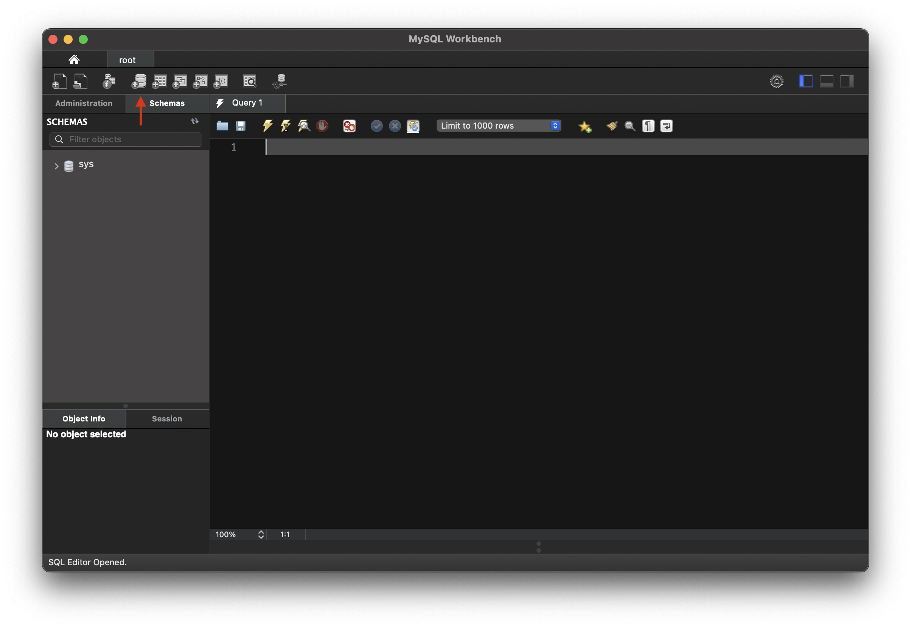
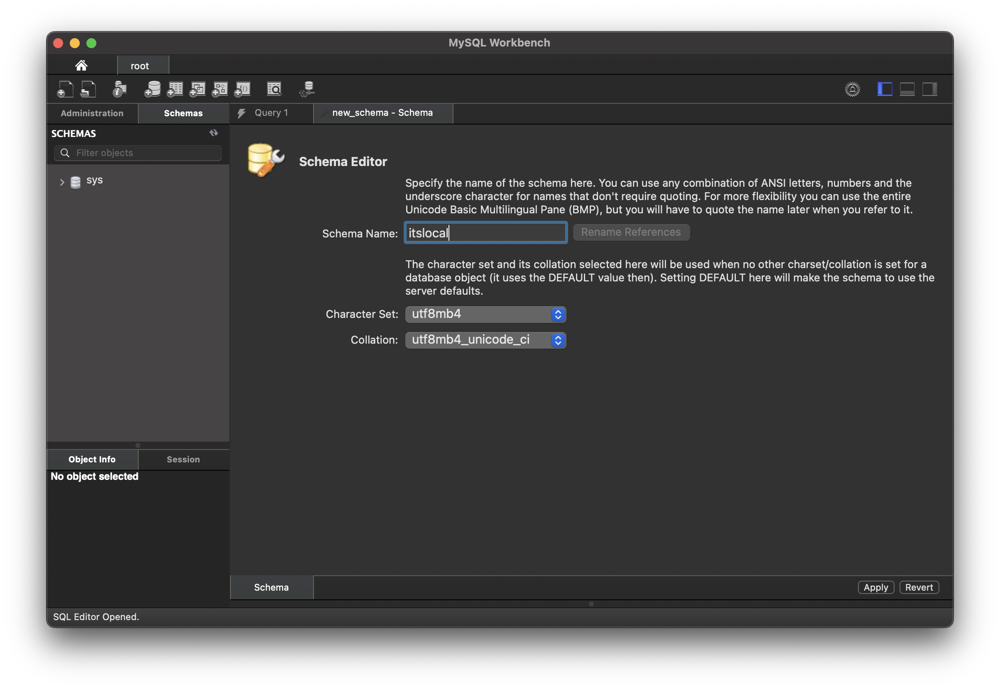

# Developer Tools

This document outlines the tools used to develop the sites. With some of the tools, I have also outlined some frequently used processes used during the development of the sites. 

## Command-line

There are many command-line tools which are used throughout the development of the sites. This section covers some of the built-in utilities which don't fall under other categories. 

### chmod

The `chmod` command is used frequently to change the permissions of directories and files in the Linux and Mac operating systems. 

#### Viewing and Understanding Permissions

To view the permissions of a directory or file, run the command `ls -l`. Alternatively, `ls -lh` also includes human readable file sizes in Mebibytes (as opposed to Megabytes). 

```title="View the permissions of files and directories in another directory"
ciesinsg@NB-00304-H14872 sites % ls -l default
total 168
-rw-r--r--@  1 ciesinsg  staff   9069 12 Jul 09:39 default.services.yml
-rw-r--r--@  1 ciesinsg  staff  35385 12 Jul 09:39 default.settings.php
drwxrwxr-x@ 10 ciesinsg  staff    320 24 Jul 15:56 files
-r--r--r--@  1 ciesinsg  staff  35997 13 Jul 09:09 settings.php
```

Each line shows the permissions for a file or a directory. The items that start with a `-` are files while the lines that start with `d` are directories. 

The next 9 characters are split into groups of three permissions, representing the `user`, `group`, and `other users` permissions in that order. The permissions are defined in a `read`, `write`, and `execute` order, where a dash means that permission is not granted to that user. 

```title="Permission Anatomy for Above Example"
#Directory Permission Example
d         rwx     rwx     r-x
directory
          owner | group | others
          all   | all   | Read and Execute

#File Permission Example
-         rw-              r--     r--
file
          owner          | group | others
          read and write | read  | read
```

- `r`: read
- `w`: write
- `x`: execute
- `-`: permission not granted

#### Changing Permissions

The chmod command can be used either with [symbolic](#symbolic-mode) mode or [numeric](#numeric-mode) mode. 

##### Symbolic Mode

Symbolic mode uses symbolic characters to add, remove or set permissions.

```title="Anatomy of symbolic chmod command"
chmod (users)(action)(permissions) (file or directory)
```

The users uses `ugoa` symbols where each means:

- `u`: `user` who owns the file or directory
- `g`: `group` user
- `o`: `other` users
- `a`: `all` of the above users

The actions available are: 

- `+`: Add permission
- `-`: Remove permission
- `=`: Set permission

The main permissions are:

- `r`: read
- `w`: write
- `x`: execute

```title="Add write permission for new_file.txt to all users"
chmod a+w new_file.txt
```

You can also chain permissions for different users with a comma:

``` title="Add read and write permissions for the owner, and read permissions for group and others"
chmod u=rw,go=r new_file.txt
```

**Note:** There are more permissions available at the [chmod manual](https://www.man7.org/linux/man-pages/man1/chmod.1.html) but these are less frequently used.

##### Numeric Mode

Numeric mode can be used as a chmod shorthand. It consists of three numbers representing the `user`, `group`, and `others` in that order. The numbers consists of one to four possible octal digits, derived by adding up the numerical representation of each permission.

- `read`: 4
- `write`: 2
- `execute`: 1

```title="All permissions for all users is represented by 777"
rwx rwx rwx
421 421 421
7   7   7
```

```title="Another example showing different permissions for each user, resulting in 756"
rwx r-x rw-
421 4-1 42-
7   5   6
```

Using this information, we can now demonstrate setting permissions using numeric mode. 

```title="Add write permission for new_file.txt to all users"
chmod 777 new_file.txt
```

You can also chain permissions for different users with a comma:

``` title="Add read and write permissions for the owner, and read permissions for group and others"
chmod 644 new_file.txt
```

The possible numerical combinations are: 

- `7`: All permissions
- `6`: Read and write
- `5`: Read and execute
- `4`: Read
- `3`: Write and execute
- `2`: Write
- `1`: Execute

Learn more about [Changing Permissions](https://www.man7.org/linux/man-pages/man1/chmod.1.html).

### Tar

The [Tar](https://www.linux.org/docs/man1/tar.html) command creates tarball archives of files and directories while preserving file permissions. This is one of the tools used to create backups of the site directories. 

## Git

Git is a version control software and is used by the Humber ITS team to back up Drupal site directories. 

Learn more about [managing the repository using Git](https://www.drupal.org/docs/user_guide/en/extend-git.html).

### Requirements

1. Basic Git knowledge - Learn more about [becoming a git guru](https://www.atlassian.com/git/tutorials).

2. Basic understanding of Git-flow - It is extremely encouraged to maintain git-flow when pushing commits to the site repositories. Learn more about [git-flow](https://www.atlassian.com/git/tutorials/comparing-workflows/gitflow-workflow).

### Branch Types

**Main** - Permanent Branch

> This is the production branch and is a permanent branch. Only new versions should be pushed to the main branch. 

**Develop** - Permanent Branch

> This is the main development branch and is the second permanent branch. New features and hotfixes should branch off from the develop branch, and then back into it when complete. Release branches should also branch out from develop before being merged into main. 

> This branch only needs to be created once:

```shell title="Create develop branch and push to origin"
git checkout -b develop 
git push --set-upstream origin develop
```

**Feature**

> This is a new feature. It can be a new element, new logic, or any other code that results in a new feature being added to the project. 

```shell title="Create a new feature branch"
git checkout -b feature/descriptive-title
```

**Hotfix**

> This is essentially a bug fix. A hotfix branch would be created specifically to address a bug or issue. Like the feature branch, the changes can later be merged back into develop. 

```shell title="Create a new hotfix branch"
git checkout -b hotfix/descriptive-title
```

**Release**

> Unlike Feature or hotfix, a release branch is typically a child of develop and is merged into main. The purpose of the release branch is to do final testing and last-minute changes before creating a tagged release on the main branch. 

```shell title="Create a new release branch"
git checkout -b release/feature-name
```

### Additional Info

Some more information can be found in these links. These are meant to get a better understanding of how Git can be used on a Drupal site, as well as best practices and the Git-flow method of creating branches. It should not be used in place of the other instructions in this document. 

[Building a Drupal Site with Git](https://www.drupal.org/docs/installing-drupal/building-a-drupal-site-with-git)

[Building a Drupal Site with Git](https://www.drupal.org/docs/installing-drupal/building-a-drupal-site-with-git)

[Successful Git Branching Model](https://nvie.com/posts/a-successful-git-branching-model/)

## MySQL

MySQL is the main database used in the Humber development and production environments. This section outlines some common use cases.

### Installation

You need to install two tools to use MySQL locally. 

1. MySQL Workbench

The [MySQL Workbench](https://dev.mysql.com/downloads/workbench/) is the software used to connect to the MySQL database. 

2. MySQL Community Server `8.0.xx`

The [MySQL Community Server](https://dev.mysql.com/downloads/mysql/) is the actual MySQL server you need to run locally. The MySQL Workbench can connect to this server. Currently, MySQL Workbench can only connect to MySQL Community Server `5.7.xx` or `8.0.xx`, so make sure you download an 8.0.xx version. 

### Server Setup

The following instructions are for setup on Mac. 

#### Add Root Connection

The root connection will be used to connect to the local server and write queries. This can be later used to create new users and databases.

1. Install the downloaded MySQL Community Server `8.0.xx`. During the installation it will ask you to set a password. Use the default password option and not legacy. Type in your password carefully as the software will not ask you to verify the password. 
2. Open System Settings and scroll to the bottom in the left panel. Select MySQL. In the right side of the window, click Initialize database and enter your password. Once this is complete, click "Start MySQL Server".

3. Open MySQL Workbench and click the + button.

4. Fill in the connection information as per below:

1. Click "Test Connection". This should prompt a popup asking for your password. Fill it in, making sure to checkmark "Save Password" and click OK. 

1. If you see the below window, the connection is successful. In the Setup New Connection screen, you can now click OK and the connection will be saved. 


### Create New Database

Each local website requires a unique user and schema. In MySQL the schema is synomymous with database. The website is configured to use the created user to access the database. 

Learn more about [Creating a New Database](https://git.drupalcode.org/project/drupal/-/blob/10.1.x/core/INSTALL.mysql.txt).

#### Create User

1. Connect to the root database setup in [Add Root Connection](#add-root-connection). 
2. Click Users and Privileges in the left side menu.

3. Click Create User, and then fill out the username and password.

4. Click Apply to save the new user.

**Note:** Make sure you set the host to localhost in order for the later steps to work.

#### Create Schema

1. Connect to the root database setup in [Add Root Connection](#add-root-connection). 
2. Click the Create New Schema button on the top toolbar.

3. Name the new database, then select the Character Set `utf8mb4` and the Collation `utf8mb4_unicode_ci`. Click Apply, then Apply once again. 


#### Grant User Access to Schema

1. Connect to the root database setup in [Add Root Connection](#add-root-connection). 
2. In the Query tab, type the following SQL command where `its` is replaced by the database, and `itsuser`@localhost is replaced by the username.

```
GRANT SELECT, INSERT, UPDATE, DELETE, CREATE, DROP, INDEX, ALTER, CREATE TEMPORARY TABLES
ON its.*
TO 'itsuser'@'localhost';
```

3. Click CMD+Enter on Mac or Ctrl+Enter on Windows to run the query.

## Apache

Apache server outputs the site locally to an IP address or domain. 

### Installing Apache

Install Apache using homebrew: `brew install httpd`

Learn more about [Installing Apache using Homebrew](https://tecadmin.net/install-apache-macos-homebrew/).

### Configuring Apache

The Apache configuration can be found in the directory `/opt/homebrew/etc/httpd/httpd.conf`.

The documentRoot is `/opt/homebrew/var/www`.

The default ports have been set in `/opt/homebrew/etc/httpd/httpd.conf` to `8080` and in `/opt/homebrew/etc/httpd/extra/httpd-ssl.conf` to `8443` so that httpd can run without sudo.

### Using Apache

The server can be started and stopped using the command line. 

Start the Server: `brew services start httpd`

Stop the Server: `brew services stop httpd`

### Virtual Hosts

In order to use Apache to serve multiple sites, Virtual Hosts need to be enabled and configured.

#### Enable Virtual Hosts

1. Open `/opt/homebrew/etc/httpd/httpd.conf` using Vim
2. Change the Listen port to 80: `Listen 80`
3. Enable Virtual Hosts by uncommenting the line: `#Include /opt/homebrew/etc/httpd/extra/httpd-vhosts.conf`
4. Load the `mod_rewrite` module by uncommenting the line: `#LoadModule rewrite_module lib/httpd/modules/mod_rewrite.so`

**Note:** any web frameworks use it to enable “pretty URLs”, letting site visitors use URLs like `/posts/2021/some-post-title/` while translating them into URLs like `/index.php?p=697` for the back-end. 

5. Configure a server name to silence the warning that hostname cannot be determined: `ServerName www.example.com:8080` or `ServerName localhost:80`
6. Enable PHP by loading the PHP module: `LoadModule php_module /opt/homebrew/opt/php/lib/httpd/modules/libphp.so`
7. Add the below below the other include directives: 

```
# PHP settings
Include /opt/homebrew/etc/httpd/extra/httpd-php.conf
```

8. Open `/opt/homebrew/etc/httpd/extra/httpd-php.conf` with Vim and add the below PHP configuration: 

```
<IfModule php_module>
  <FilesMatch \.php$>
    SetHandler application/x-httpd-php
  </FilesMatch>

  <IfModule dir_module>
    DirectoryIndex index.html index.php
  </IfModule>
</IfModule>
```

Learn more about [Setting Up Virtual Hosts on macOS](https://www.git-tower.com/blog/apache-on-macos/).

#### Configuring Virtual Hosts

Now that Virtual Hosts have been enabled, you can create new configurations in the `/opt/homebrew/etc/httpd/extra/httpd-vhosts.conf` file. 

1. Open `/opt/homebrew/etc/httpd/extra/httpd-vhosts.conf` using Vim
2. Paste the below configuration for each website directory you want to host locally. Ensure you change the details as per the below explanation:

```
<VirtualHost *:80>
    ServerName its-site.test
    ServerAlias *.its-site.test
    DocumentRoot "/Users/ciesinsg/Documents/Repositories/its-site/web"

    <directory "/Users/ciesinsg/Documents/Repositories/its-site/web">
        Require all granted
        AllowOverride All
    </directory>
</VirtualHost>
```

**ServerName:** This is the root URL
**ServerAlias:** This is similar to the root URL but with a wildcard for the prefix
**DocumentRoot:** This is the web directory of the Drupal site
**Directory:** This is the same web directory as Document root

**Note:** The `.test` domain can be used to differentiate the sites from real existing domains and avoid conflicts when visiting the local sites. 

The other settings can be kept the same.

#### Defining a New Host

After [Configuring Virtual Hosts](#configuring-virtual-hosts), the final step required to be able to access the new site directory is to add the definition to the `/etc/hosts` file. 

1. Due to the `/etc/hosts` file permissions, open the file using Vim as a superuser: `sudo vim /etc/hosts`.
2. Add a new definition to the file: 

```
127.0.0.1       its.test
```

## Composer

In order to make maintenance easier, all of the Humber ITS Drupal Sites were built using [Composer](https://getcomposer.org/). 

#### Installing PHP

Homebrew is required in order to install PHP. Please visit the TechZone for help installing Homebrew. 

1. Search for and open “Terminal” in your app drawer. 
2. Run the command: `brew install php`
3. Test your PHP installation by running: `which php` -> which should output -> `/opt/homebrew/bin/php`

**Note:** These instructions are not guaranteed to work on Intel Macbooks and were created for Apple Silicon. 

#### Installing Composer

##### Requirements

1. Homebrew
2. PHP
3. Apple Mac with Apple Silicon chip (M1 or M2 chip)

**Notes:** 

1. It is recommended to install Composer in the `/usr/local/bin` directory as this directory is already included in the `$PATH`. This means that you can invoke composer in the Terminal without manually adding the composer install directory to `$PATH`. The steps to do this are outlined in the next section.
2. The steps after and including step 4 are taken from [these instructions](https://getcomposer.org/doc/). It is important to run the below steps 1-3 for installation on Humber Apple Silicon (M1 & M2 chip) Macbooks because the /usr/local/bin folder is controlled by PAM by default, and simply following the instructions in the link will result in the Terminal blocking the command. 

##### Instructions

3. Search for and open **Terminal** in your app drawer. 
4. Change directories to `/usr/local/bin` by copying and pasting the following command into the Terminal: `cd /usr/local/bin`
5. Take ownership of the `/usr/local/bin` folder by copying and pasting the below command into the Terminal: 

```
sudo chown -R $(whoami) /usr/local/bin
```

If prompted for a password, enter your Microsoft 365 password.

4. Download install files running the command: 

```
php -r "copy('https://getcomposer.org/installer', 'composer-setup.php');" 
```

5. Verify the download file integrity: 

```
php -r "if (hash_file('sha384', 'composer-setup.php') === 'e21205b207c3ff031906575712edab6f13eb0b361f2085f1f1237b7126d785e826a450292b6cfd1d64d92e6563bbde02') { echo 'Installer verified'; } else { echo 'Installer corrupt'; unlink('composer-setup.php'); } echo PHP_EOL;"
```

*Note:* If the Terminal outputs Installer verified, continue from step 6. If it instead outputs Installer corrupt, read the INSTALLER CORRUPT ERROR section below these instructions before continuing.

6. Install composer by running the command: `php composer-setup.php`

7. Delete the installer by running the command: `php -r "unlink('composer-setup.php');"`


8. Rename composer by running the command: `sudo mv composer.phar composer`

**Note:** This step is important for the Terminal to globally recognize commands starting with composer. Otherwise you will need to use `composer.phar` instead of `composer` which may result in unexpected bugs. 

9. Test the installation by running the command: `which composer ` -> which should output -> `/usr/local/bin/composer`

##### Installer Corrupt Error

It is very likely that you will get the error Installer corrupt when attempting Step 5 of this installation. The reason for this is that step 5 uses a hash to verify the integrity of the download, but the hash will change with each new version of composer. 

If this happens, start once again from Step 4. 

When you get to Step 5, visit this website https://getcomposer.org/download/ and copy & paste the line starting with `php -r "if (hash_file…` into the Terminal in place of the command listed in Step 5. This will ensure that the current and latest hash is used to verify the integrity of the file. 

Continue the remaining instructions until installation is complete.  

### Creating a New Website

Use the drupal/recommended-project-template to create a new project.

1. `cd` into your repository folder and create a new folder for the project with `mkdir project-name` where the project-directory is the name of the project.
2. Create a new project with `composer create-project drupal/recommended-project project-name`.
3. Add a [new Virtual Hosts configuration](#configuring-virtual-hosts) pointing at this new project directory.
4. Visit the URL you configured in Step 3 and follow the installation prompts.

Learn more about [Using Composer to Install Drupal](https://git.drupalcode.org/project/drupal/-/blob/11.x/core/INSTALL.txt).

## Drush

[Drush](https://www.drush.org/) provides command-line tools for all of the Humber ITS Drupal Sites and is required to carry out some of the steps outlined further in these docs.

### Installing Drush

**Note:** If you cloned the existing site repositories, then it is likely that drush was automatically installed via the `composer.json` file in the site repository and does not need to be installed again. These instructions are mainly for any new Humber ITS Drupal sites. 

Drush can be installed using Composer: 

1. `cd` into the website root folder using Terminal.
2. Install drush using the command: `composer require --dev drush/drush`

### Drush Actions

There are a number of actions that can be performed using Drush. This section contains the actions which are commonly used in Humber ITS Drupal sites. 

#### Clear Cache

This is the quickest way to clear cache and is very useful when developing custom themes. Sometimes, changes to the theme do not reflect on the page due to outdated cache information. Run this command before refreshing the page to ensure the changes are rendered by the site:

```shell title="Clear cache using Drush"
drush cr
```

#### One Time Login

**Note:** drush is required in order to follow these steps.

If a user is unable to login for some reason, it is possible to send them a one-time login using drush uli. If successful, it will output a URL that the user can use to login and change their password. 

```shell title="Generate a one-time login link" linenums="1"
drush uli --name=username  --uri=website-url
```