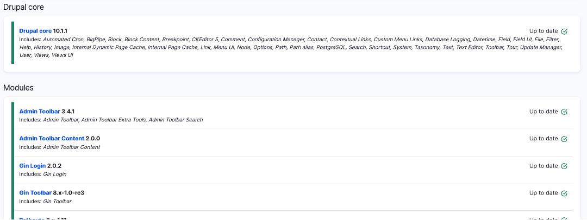

# Drupal Sites

## Introduction

This document contains information that is shared between all the Humber ITS Websites built using Drupal. 

This includes information about settings, core and module updates, backing up and restoring sites, content updates, or possible bugs. 

### Start Date

The design & build process for the ITS websites started on April 2023. 

### Team

* **Lora Nasim** - Coordinator
* **George Ciesinski** – Web Developer
* **Michael Boadu** – Marketing and Communications Coordinator 

### Requirements

The ITS website serves tens of thousands of Faculty Members, Staff and Students in a College environment. The below requirements will help to provide a positive and secure experience to all website users: 

1.	**Security** – The website should stay up to date with major security updates, and should include authentication for all users who modify the content of the site. 
2.	**Optimization** – All images, videos, and other assets should be optimized before usage on the site to ensure a fast browsing experience.
3.	**Accessibility** – Content should meet the accessibility requirements outlined in the AODA (Accessibility for Ontarians with Disabilities Act) 

### Tools 

[HUMBER WEB ACCESSIBILITY COMPLIANCE (AODA)](https://humber.ca/tutorial/web-accessibility-compliance.html) - provide access to the WCAG Quick-Reference guide and AODA Compliance Reference, as well as various tools that assist in evaluating Web Accessibility. 

### Guidelines

[Humber Interim Web Guidelines](https://humber.ca/brand/sites/default/files/publications/interim-web-guidelines.pdf
) - provides guidelines for standards Humber Websites should meet.

### Stack

The Humber ITS Stack uses:

* Linux OS
* Apache Server
* PostgreSQL
* PHP

## Development

### Backups

It is important to back up the website whenever there is a core/module update, or when significant amounts of content are added. This ensures that the site can be restored in case of any unforeseen event. Additionally, this allows us to migrate the site from one server to another if needed.

Backups are very important and should be tested to ensure it is possible to restore the site from the backups.

#### Complete Backup

In order to make a complete backup, several parts of the Drupal site must be backed up separately. 

1.	Source Code / Web Root

Todo: 

* Add remaining backup steps

The Drupal root folder must be backed up with Git. It is important to note that a Git backup is incomplete and doesn’t backup the `settings.php` file or the database. 

#### Git

Git is a kind of version control used by the Humber ITS team to back up Drupal site directories. This is not a complete back-up of the site, but instead contains changes to source code and some configurations for the site. 

Learn more about [managing the repository using Git](https://www.drupal.org/docs/user_guide/en/extend-git.html).

##### Requirements

1. Basic Git knowledge - Learn more about [becoming a git guru](https://www.atlassian.com/git/tutorials).

2. Basic understanding of Git-flow - It is extremely encouraged to maintain git-flow when pushing commits to the site repositories. Learn more about [git-flow](https://www.atlassian.com/git/tutorials/comparing-workflows/gitflow-workflow).

###### Branch Types

**Main** - Permanent Branch

> This is the production branch and is a permanent branch. Only new versions should be pushed to the main branch. 

**Develop** - Permanent Branch

> This is the main development branch and is the second permanent branch. New features and hotfixes should branch off from the develop branch, and then back into it when complete. Release branches should also branch out from develop before being merged into main. 

> This branch only needs to be created once:

```shell title="Create develop branch and push to origin"
git checkout -b develop 
git push --set-upstream origin develop
```

**Feature**

> This is a new feature. It can be a new element, new logic, or any other code that results in a new feature being added to the project. 

```shell title="Create a new feature branch"
git checkout -b feature/descriptive-title
```

**Hotfix**

> This is essentially a bug fix. A hotfix branch would be created specifically to address a bug or issue. Like the feature branch, the changes can later be merged back into develop. 

```shell title="Create a new hotfix branch"
git checkout -b hotfix/descriptive-title
```

**Release**

> Unlike Feature or hotfix, a release branch is typically a child of develop and is merged into main. The purpose of the release branch is to do final testing and last-minute changes before creating a tagged release on the main branch. 

```shell title="Create a new release branch"
git checkout -b release/feature-name
```

##### Additional Info

Some more information can be found in these links. These are meant to get a better understanding of how Git can be used on a Drupal site, as well as best practices and the Git-flow method of creating branches. It should not be used in place of the other instructions in this document. 

[Building a Drupal Site with Git](https://www.drupal.org/docs/installing-drupal/building-a-drupal-site-with-git)

[Managing File and Configuration Revisions with Git](https://www.drupal.org/docs/user_guide/en/extend-git.html)

[Building a Drupal Site with Git](https://www.drupal.org/docs/installing-drupal/building-a-drupal-site-with-git)

[Successful Git Branching Model](https://nvie.com/posts/a-successful-git-branching-model/)

#### Backup Database

Todo: 

* Complete this section

##### Additional Info

[Concept: Data Backups](https://www.drupal.org/docs/user_guide/en/prevent-backups.html)

[Back up your site using the command-line](https://www.drupal.org/docs/7/backing-up-and-migrating-a-site/back-up-your-site-using-the-command-line)

[Pg_dump Documentation](https://www.postgresql.org/docs/7.1/app-pgdump.html)

[Pg_restore Documentation](https://www.postgresql.org/docs/7.1/app-pgrestore.html)

#### Development Site

It is not recommended to carry out core and module updates on the live/production version of the site because it could introduce breaking changes that are difficult to reverse. It may also result in an unexpected outage. Instead, it is recommended to set up a local development site which is essentially a clone of the live/production server. The process of setting up a local development site can also be used to verify the integrity of the backup files. 

This development site is used for updates and major changes as well as for testing. Once the testing is complete, the changes can be pushed to the live site. 

[Making a Development Site](https://www.drupal.org/docs/user_guide/en/install-dev-making.html)

#### Site Maintenance

Presents message that the site is under maintenance to users who do not have the right permissions. Authorized users can maintain the site and update content during this time. 

[Enabling and Disabling Maintenance Mode](https://www.drupal.org/docs/user_guide/en/extend-maintenance.html)

##### Core and Module Update

Drupal core and the various modules the site uses are frequently updated to address security issues and bugs that come up over time. In many cases, it is beneficial to update these components to ensure that the Humber site is secure and working correctly.

###### How to tell there's updates?

Updates can be checked using the Admin toolbar on the website by visiting the Available Updates section. 

`Reports` > `Available Updates`

This will show a screen like this which shows if Drupal core and modules are up to date:



If any of these components do not show `Up to date` and a green check mark, those components may have updates.

###### Should I update?

Updates should be made if they address a security flaw or a bug that may affect the website. You can check this by visiting the pages of the Drupal core version or the module project pages and reading the release notes. Any significant changes will be listed there, and a decision can be made based on this information.

Learn more about [Updating Core Software](https://www.drupal.org/docs/user_guide/en/install-composer.html).

Learn more about [Updating Modules](https://www.drupal.org/docs/user_guide/en/security-update-module.html).

Learn more about [Updating Themes](https://www.drupal.org/docs/user_guide/en/security-update-theme.html).

###### Testing Updates

Updates should be made on the development website and tested thoroughly before pushing to production. This would help with catching any incompatibilities or issues that may come up from the updates.  

#### Settings.php

The `settings.php` file contains sensitive data about the website such as the database connection, trusted host, and configuration information. 
This file should NOT be uploaded to Github. Instead, it should be backed up in a secure location. 

The file is also read-only by default which is required to ensure the site is secure, however, there are many instances where the administrator may have to edit this file. The instructions to do this are below.

##### Location of the settings.php file

The settings file can be found in: `/project-folder/web/sites/default/`

##### Making changes to settings.php

The `settings.php` file is read-only by default which is a security precaution to ensure the site is not able to alter it in any way. In order to make changes, you must locally change the permission of the file to give yourself write access, make the required changes, and once again harden the permissions. This ensures that the file contents are only changed in an authorized way and not by malicious actors. 

1.	Open the terminal and `cd` into the [settings.php directory](#location-of-the-settingsphp-file). 
2.	Make the file editable:

    ```shell title="Add write permissions to settings.php"
    chmod a+w settings.php
    ```

3. Make the required changes using a text editor like vim or nano.
4. Harden the permissions after editing the file: 

    ```shell title="Add write permissions to settings.php"
    chmod 444 settings.php (Results in permissions -r-r--r--)
    ```    

##### Frequently Required settings.php Changes

###### Trusted-Host

The trusted host settings tell the website which hosts are authorized to access the site. This is an important security measure to ensure that fraudulent hosts cannot be used to access the site or create unauthorized clones.

This setting essentially tells the site which URL is allowed to access the site, and it affects both the production/live version of the site and the local development version. In the event that the host name changes, the trusted host settings must be modified to reflect this. 

The trusted host setting looks like this in settings.php: 

```shell title="Trusted-host settings" linenums="1"
$settings['trusted_host_patterns'] = [
  '^www\.its-cab\.test$',
  '^its-cab\.test$'
];
```

This is an array containing multiple comma-separated lines with the various host patterns. The standard is to indent each line with two spaces. The patterns themselves are defined using REGEX. 

###### Update Free Access

This setting is used during core updates. 

Todo:

* Complete this section
