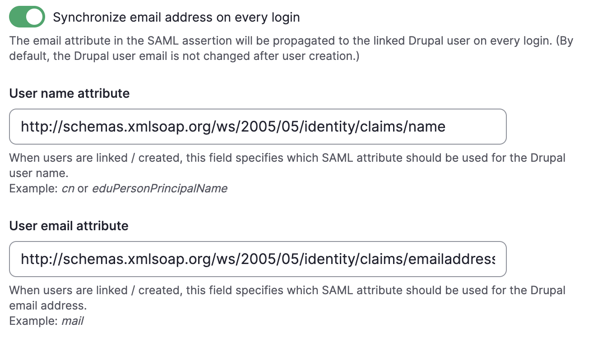

# Drupal Sites

## Introduction

This document contains information that is shared between all the Humber ITS Websites built using Drupal. This includes information about settings, core and module updates, backing up and restoring sites, content updates, or possible bugs. 

**Warning:** There are many links I have included across various sections of this documentation for further reading. Many of these links contain good information, but many also contain outdated information from older versions of Drupal. 

### Stack

Humber ITS Drupal Sites use the LAMP stack:

* Linux OS
* Apache Server
* MySQL
* PHP

## Development

This section is primarily for developers. It covers backing up and restoring both the Drupal Sites, and their corresponding databases. In addition to this, it also covers carrying out maintenance tasks, and important development concepts such as the `settings.php` file and other configuration files. 

For more information about developer tools, see the [Developer Tools](./developer-tools.md) documentation. 

### Creating a New Drupal Site

A new Drupal site is created locally before being pushed to the staging server. Once the site is ready to go live, it can be pushed to the production server. This section focuses on the local setup.

Learn more about [Development Environments](development-environments.md).

**Server Requirements**

- [MySQL User and Database](developer-tools.md#mysql)
- [Apache Server](developer-tools.md#apache)

### Settings.php

The `settings.php` file contains sensitive data about the website such as the database connection, trusted host, and configuration information. 
This file should not be uploaded to Github. Instead, it should be backed up in a secure location. 

The file is also read-only by default which is required to ensure the site is secure, however, there are many instances where the administrator may have to edit this file. The instructions to do this are below.

#### Location of the settings.php file

The settings file can be found in: `/project-folder/web/sites/default/`

#### Making changes to settings.php

The `settings.php` file is read-only by default which is a security precaution to ensure the site is not able to alter it in any way. In order to make changes, you must locally change the permission of the file to give yourself write access, make the required changes, and once again harden the permissions. This ensures that the file contents are only changed in an authorized way and not by malicious actors. 

**Note:** It is recommended to back up the original file in case something goes wrong with the change. In the event that you experience issues moving `settings.php` in or out of the directory, you can also temporarily change the `/project-folder/web/sites/default/` to `777`. Make sure that once you are finished, you change the permissions back to `555`.

1.	Open the terminal and `cd` into the [settings.php directory](#location-of-the-settingsphp-file). 
2.	Make the file editable:

    ```shell title="Add write permissions to settings.php"
    chmod 777 settings.php
    ```

3. Make the required changes using a text editor like vim or nano.
4. Harden the permissions after editing the file: 

    ```shell title="Add write permissions to settings.php"
    chmod 444 settings.php (Results in permissions -r--r--r--)
    ```    

#### Frequently Required settings.php Changes

##### Trusted-Host

The trusted host settings tell the website which hosts are authorized to access the site. This is an important security measure to ensure that fraudulent hosts cannot be used to access the site or create unauthorized clones.

This setting essentially tells the site which URL is allowed to access the site, and it affects both the production/live version of the site and the local development version. In the event that the host name changes, the trusted host settings must be modified to reflect this. 

The trusted host setting looks like this in settings.php: 

```shell title="Trusted-host settings" linenums="1"
$settings['trusted_host_patterns'] = [
  '^www\.its-cab\.test$',
  '^its-cab\.test$'
];
```

This is an array containing multiple comma-separated lines with the various host patterns. The standard is to indent each line with two spaces. The patterns themselves are defined using REGEX. 

##### Change the Database Connection

At the bottom of the `settings.php` file, you can find `$databases['default']['default']` which is an array containing the database connection details. On a local environment, this will point at the local MySQL database. The staging environment will also have its own database, and the same is true for the production environment.

To change the database connection, change the below kev-value pairs: 

- `database`: database name
- `username`: database username
- `password`: database password
- `host`: either `'localhost'` or the host provided by the server team

Learn more about [Changing the Database Connection in Drupal's Settings.php](https://ostraining.com/blog/drupal/change-the-database-connection/#:~:text=Change%20the%20Database%20Connection%20in%20Drupal%E2%80%99s%20Settings.php%201,...%206%20Step%20%236.%20Upload%20your%20changes%20)

##### Reverse-proxy Settings

Humber servers operate over a load balancer which causes Drupal sites to think they are using the http protocol instead of https. This becomes more apparent when Drupal sites need to generate URLs like a metadata URL or ACS URL. If your site is generating these URLs with `http://` instead of `https://` then you need to add the below to your `settings.php` file:

```php title="Reverse-proxy Config"
$settings['reverse_proxy'] = TRUE;
$settings['reverse_proxy_addresses'] = array($_SERVER['REMOTE_ADDR']);
$settings['reverse_proxy_trusted_headers'] = \Symfony\Component\HttpFoundation\Request::HEADER_X_FORWARDED_PROTO | \Symfony\Component\HttpFoundation\Request::HEADER_FORWARDED;
```

## Maintenance

### Core and Module Update

Drupal core and the various modules the site uses are frequently updated to address security issues and bugs that come up over time. In many cases, it is beneficial to update these components to ensure that the Humber site is secure and working correctly.

**Warning:** It is highly recommended to backup the site and database before carrying out an update. Updating can run automatic scripts that update the database, and if anything goes wrong it can cause source code and data loss that may be unrecoverable.

#### How to tell there's updates?

Updates can be checked using the Admin toolbar on the website by visiting the Available Updates section. 

`Reports` > `Available Updates`

This will show a screen like this which shows if Drupal core and modules are up to date:


If any of these components do not show `Up to date` and a green check mark, those components may have updates.

#### Should I update?

Updates should be made if they address a security flaw or a bug that may affect the website. You can check this by visiting the pages of the Drupal core version or the module project pages and reading the release notes. Any significant changes will be listed there, and a decision can be made based on this information.

Learn more about [Updating Core Software](https://www.drupal.org/docs/user_guide/en/install-composer.html).

Learn more about [Updating Modules](https://www.drupal.org/docs/user_guide/en/security-update-module.html).

Learn more about [Updating Themes](https://www.drupal.org/docs/user_guide/en/security-update-theme.html).

#### Updating Core Minor Version

Updating a minor version (ex. Drupal 10.1 -> Drupal 10.2) is usually quite simple. Despite this, it is always recommended to go to the [Releases](https://www.drupal.org/project/drupal/releases) page and click the version you want to update to. 

Once you are on the specific release page, there are multiple snippets you can copy to either install this Drupal version, update to the latest version, or update to this specific version. It is recommended to heed the warning to update to the latest version as pinning to a specific release may make it more challenging to update your site in future.

#### Updating Major Version

Updating a major version (ex. Drupal 9 -> Drupal 10) can be more difficult and ultimately depends on the versions involved. Every major version can contain many changes and may require specific steps to properly update. 

When updating to a new major version, it is recommended to look up the Drupal version and read the documentation as this usually indicates the best way to carry out an update. 

#### Testing Updates

Updates should be made on the development website and tested thoroughly before pushing to production. This would help with catching any incompatibilities or issues that may come up from the updates.  

## Roles

Roles are a way to define users and establish a list of permissions the user has. Users can be assigned different roles, and roles can be edited to change the name or the list of permissions they have.

By default, Drupal has three roles: 

* [Anonymous Users](#anonymous-users)
* [Authenticated Users](#authenticated-users)
* [Administrator Users](#administrator-user)

### Users

Users are accounts with usernames and passwords. Drupal sites come with a User 1 account and all other users must be created by the admin, or by new users requesting accounts on the site.

Learn more about [Users](https://www.drupal.org/docs/user_guide/en/user-concept.html ).

### Configuring User Account Settings

It is possible to configure many aspects of user accounts including whether users should be able to request/open their own accounts, or whether an admin has to do this step manually. 

Learn more about [Configuring Users](https://www.drupal.org/docs/user_guide/en/config-user.html).

### User 1

The User 1 account is the first account created along with the site and is known as the diety account in Drupal. This is because it has significant administrative powers and can be used to create other admin accounts. It also has the power to perform any action on the site regardless of permissions.

### Anonymous Users

Anonymous users are any users who visit the site without logging in. This is defined as a role and the permissions for these users can be separately configured.

### Authenticated Users

Authenticated users are any users who have accounts and can sign in. Any user who can sign in, regardless of whether they've been assigned a role, is an authenticated user.

### Administrator User

Administrator users have access to all of the functions of Drupal. They are not only able to create new content, but can define content types, structures, and have administrative control over roles and other users. 

### Additional Roles

Various roles can be created on the site. These roles can be named anything you want, and the permissions for each role can be customized in many ways. For example, it is possible what content an account can see, edit, create and delete. There is much more to the permissions system, so to get a thorough understanding of it, it is necessary to dig into the official Drupal docs. 

To see the specific roles which were created on the various Drupal sites, please visit the **Roles** section in the Specific Documentation for that particular site.

Learn more about [Managing User Accounts](https://www.drupal.org/docs/user_guide/en/user-chapter.html).

#### Creating a New Role

Learn about Creating a New Role. 

#### Assigning Permissions to a Role

Once a role is created, the permissions must be defined. It can be helpful to look at other roles’ permissions to see how they are set up, and create the permissions based off this. In some cases, you may need to dig deeper about which permission to add to a role in case you are trying to achieve a specific purpose. 

**Note:** It is NOT recommended to add a permission to a role if it will only benefit a single user. This would grant that permission to every user who is assigned to that role. In that case, it would be beneficial to create a new unique role for that user. 

Learn more about [Assigning Permissions to a Role](https://www.drupal.org/docs/user_guide/en/user-permissions.html).

#### Changing a User's Role

Roles must be assigned to new users so they can enjoy the permissions of that role. Users with no assigned roles are simply authenticated users. In order to assign special permissions to those users, it is recommended to assign a role to them and not to modify the permissions of authenticated users. 

Learn more about [Changing a User's Role](https://www.drupal.org/docs/user_guide/en/user-roles.html).

## Modules

Modules extend functionality and add features. Installing the feature adds functionality, while uninstalling it removes it. Modules increase the time needed to generate a page, so it is important to only keep modules you use installed and remove the unused ones. 

In general, modules will not be added to sites frequently. They will only be added to create a new feature that may require a contributed module in order to function correctly. 

Most actions we perform on modules will be maintenance as new versions are released.

### Installing Modules

Modules can be found at the [Drupal Modules page](https://www.drupal.org/project/project_module). 

1. Use the search bar to find a module, and click the link to view more details about the module. 

1. Once you find a module you want to install, scroll down to the **Releases** section. Find a release that is compatible with the same Drupal version the site is using. 

1. Click the **copy** button to the right of the **Install:** code block. This code block should contain a composer installation script that looks similar to `composer require 'drupal/project_name:version#'`

1. cd to the project directory using Terminal, and paste the composer command. This will download the project and dependencies. 

1. In your site, click the **Extend** link in the Admin Toolbar, and scroll down until you find the module you downloaded with composer in the previous step. The modules also list all of their required dependencies. 

1. Make sure all the dependencies are checkmarked and click Install.

Learn more about [Installing Modules](https://www.drupal.org/docs/extending-drupal/installing-modules).

### Uninstalling Modules

1. In your site, click the **Extend** link in the Admin Toolbar, then click the **Uninstall** tab and scroll down until you find the module you want to uninstall. 

1. Checkmark the dependency, and click **Uninstall** at the bottom of this page. 

1. Open the `composer.json` file using a text editor of your choice, and delete the entry from the **Require** object. 

1. cd to the project directory using Terminal, and run the command `composer update`. This will uninstall the module and unused dependencies. 

Learn more about [Uninstalling Modules](https://www.bing.com/search?pglt=41&q=drupal+uninstall+module&cvid=6644fd8583ff471ba5ab01ad0e8b6f9b&aqs=edge.0.0l6j69i64l2j69i11004.2222j0j1&FORM=ANAB01&PC=U531)

### Using Composer to Manage Dependencies

All the Humber ITS Websites are builit with Composer. This makes adding and updating modules very simple. 

Learn more about [Managing Dependencies using Composer](https://www.drupal.org/docs/develop/using-composer/manage-dependencies#adding-modules).

### Before Updating

The website might flag some modules that are outdated, but care should be taken before updating any module. It is important to go over the various modules in use on the site and check the module Drupal pages to see if there are any special instructions for carrying out updates. 

Furthermore, it is important to make sure we are using the correct module for the core version. If using Drupal 10, only modules compatible with Drupal 10 should be used. If a new version of a module is built for Drupal 11, the core files should be updated first, and only if it is deemed appropriate to update the core version.

### Modules

This section includes many useful modules as well as any specific instructions to setup and use the modules. 

#### Admin Toolbar

[https://www.drupal.org/project/admin_toolbar](https://www.drupal.org/project/admin_toolbar)

Improves the default toolbar and changes it into a drop-down menu with fast access to each administrative page. 
In the Extend menu, the following options are also enabled: 

* Admin Toolbar Content
* Admin Toolbar Extra Tools
* Admin Toolbar Search

#### Calendar View

The [Calendar View](https://www.drupal.org/project/calendar_view) module displays views results on an interactive calendar. This module is used to display change requests within a calendar.

#### Charts

The [Charts](https://www.drupal.org/project/charts) module displays views result fields as charts. It also provides lots of configuration options such as colors, title, labels, and more.

#### Date Popup

The [Date Popup](https://www.drupal.org/project/date_popup) module adds a native HTML5 popup widget to the date fields in views filters so that users don't have to manually enter dates. 

#### Field Group

The [Field Group](https://www.drupal.org/project/field_group) module adds the functionality to group fields on forms and displays.

#### Field Permissions

The [Field Permissions](https://www.drupal.org/project/field_permissions) module allows administrators to set field level permissions so that certain fields can only be viewed by specific roles. 

#### Pathauto

https://www.drupal.org/project/pathauto

This module is used to automatically generate unique URL’s for new content. Default Drupal behavior results in URL snippets like `node/1`, but PathAuto can be used to create templates so that URLs might instead look like `photo/2` or `change-request/143`.

##### Configuring Pathauto

1. After installing Pathauto, go to **Admin -> Configuration -> Search & Metadata -> URL Aliases**
1. Click the Patterns tab
1. Click **+ Add Pathauto pattern**
1. Select the Pattern type "Content" and add the configuration `[node:content-type][node:nid]`

Different content may require a different configuration. For more information, see the link below. 

Learn more about using [PathAuto](https://ostraining.com/blog/drupal/pathauto-2/).

#### R4032 Login

[https://www.drupal.org/project/r4032login](https://www.drupal.org/project/r4032login)

This module redirects anonymous users to login if the content they are trying to view requires a certain level of permissions. 

#### SAML Authentication

[https://www.drupal.org/project/samlauth](https://www.drupal.org/project/samlauth)

This module is used to add SAML SSO to your Drupal Site. It is recommended to read through the [SAML Authentication README](https://git.drupalcode.org/project/samlauth).

#### Gin Theme

Gin theme is an administrator theme with a number of useful submodules. 

##### Gin Admin Theme

[https://www.drupal.org/project/gin](https://www.drupal.org/project/gin)

Beautiful Admin theme. In appearance settings, set the admin theme to Gin for this to take effect.

##### Gin Toolbar

[https://www.drupal.org/project/gin_toolbar](https://www.drupal.org/project/gin_toolbar)

Helper module that brings Gin theme to the admin toolbar.

#### Field Group

[https://www.drupal.org/project/field_group](https://www.drupal.org/project/field_group)

Allows you to group fields in forms so that they are easier to organize.

#### Field Permissions

[https://www.drupal.org/project/field_permissions](https://www.drupal.org/project/field_permissions)

Provides field level permissions for different roles.

## SAML Setup

SAML is a standard used to provide SSO functionality within Humber's Microsoft Azure environment. 

First, install the SAML Authentication module and then proceed with the following sections. 

### Reverse Proxy Settings

Add the below reverse proxy settings to your `settings.php` file:

```
$settings['reverse_proxy'] = TRUE;
$settings['reverse_proxy_addresses'] = array($_SERVER['REMOTE_ADDR']);
$settings['reverse_proxy_trusted_headers'] = \Symfony\Component\HttpFoundation\Request::HEADER_X_FORWARDED_PROTO | \Symfony\Component\HttpFoundation\Request::HEADER_FORWARDED;
```

**Note:** This step is required due to Humber's AWS servers being behind a load balancer. This prevents the site from seeing it's actual IP and protocol and Drupal falsely thinks that it is using `http` instead of `https` protocol. As `https` is required for Humber's Azure policy, these settings are needed to ensure Drupal sees the correct protocol. 

### Generate Key and Cert Files

1. Create a folder for your key and cert files. One option is to keep both files in a folder called `saml_cert` in your Drupal root directory.
1. `cd` into the desired folder and run the below command and follow the directions in the prompts.

```
openssl req -new -x509 -days 3652 -nodes -out sp.crt -keyout sp.key
```

**Note:** The private key file should not be in your `/web` directory. 

### Configuring SAML Authentication

Once SAML Authentication has been installed, you can access the settings under **Configuration -> People -> SAML authentication**. 

As the settings page contains multiple tabs and multiple sections within the tabs, I specified each tab and section for the below settings. For any settings not mentioned, leave the default value. 

#### Configuration Tab

##### Login/Logout Section

1. Under "Roles allowed to use Drupal login also when linked to a SAML login", checkmark any roles that should still be able to login without SAML. Admin is recommended as a SAML outage could cause the site to be inaccessible.

##### Service Provider Section

1. Set an Entity ID. This can be `https://your-site.io` or whatever your URL is
1. Under "Type of values to save for the key/certificate" select "File"
1. Under "Private Key filename" and "X.509 Certificate Filename" enter the absolute paths for both files. This should look similar to `/var/www/websites/site_name/saml_cert/sp.key` & `/var/www/websites/site_name/saml_cert/sp.crt`

{ width="500" }

**Important:** After you have configured the Service Provider Section, your Project Manager should connect you with Digital Solutions. You will need to provide them with the below information, and they will provide you with a metadata URL you will need for the next section. 

1. App Name: Name of your app.
2. Entity ID: The ID configured in the Service Provider Section.
3. Reply URL: This is listed in the Service Provider Section beside "Assertion Consumer Service".
4. Who needs access: Which department or individuals should have access to the site.

{ width="500" }

##### Identity Provider Section

SAML Authentication doesn't have any way of parsing the metadata URL, so at this time it is recommended to open this URL in the browser to view the xml, and `ctrl + f` the information you need.

1. For "Entity ID", find the value in `entityID=`
2. For "Single Sign On Service", find the value in `<SingleSignOnService...`
3. For "Single Logout Service", find the value in `<SingleLogoutService...`
4. For "Type of values to save for the certificate(s)" select `Configuration`
5. For "Certificate", paste in the X.509 certificate from the metadata URL. This will start with `<X509Certificate>`

{ width="500" }

{ width="500" }

##### User Info and Syncing Section

1. For "Unique ID attribute" paste `http://schemas.xmlsoap.org/ws/2005/05/identity/claims/name` which is the Azure username attribute, and is used as the unique identifier for SSO. If this doesn't work, you can view the XML for all the available attributes.
1. To enable name matching (read below for more information), checkmark "Enable matching on name" under "Attempt to link SAML data to existing local users".
1. Ensure that you checkmark which names are eligible for matching to their SSO accounts. 
1. Enable "Synchronize email address on every login" for the email address to be updated automatically.
1. For "User name attribute" enter `http://schemas.xmlsoap.org/ws/2005/05/identity/claims/name`
1. For "User email attribute" enter `http://schemas.xmlsoap.org/ws/2005/05/identity/claims/emailaddress` 

{ width="500" }

{ width="500" }

**Name Matching & User Creation:** Name matching allows Drupal to match an existing user with the SSO account when the user logs in. This requires creating the user first with their username@humber.ca, and then logging in with the user. If you require new users to be created when they login by SSO for the first time, you must instead enable "Create users from SAML data". 

##### SAML Message Construction

At the time of writing this guide, this section can be left unchanged.

##### SAML Message Validation Section

1. Enable "Retrieve logout signature parameters from $_SERVER['REQUEST']"
1. Disable "Require messages to be signed"

{ width="500" }

##### Debugging Section

There are no settings that need to be turned on in this section, but it provides useful tools for debugging. I recommend enabling "Show detailed errors to the user" while configuring SAML.

#### User Field Mapping Tab

This tab is for configuring attribute mapping, and these settings are optional. By default, Drupal users only have usernames. If you need user accounts to also sync names, you need to first create a new user field, and then configure attribute mapping in SAML Authentication. 

##### Adding a User Field

1. First, you need to add a name field in Account Settings. You can do this by going to **Configuration -> People -> Account Settings -> Manage Fields**. 
2. Click "Create a New Field". If you want to have the complete Display Name (first and last name combined) then simply create a "Display Name" field with the field type "Text (plain)". You can also configure the "Manage Form Display" and "Manage Display" sections to your liking. 
3. Once this is done, go back to the User Field Mapping tab under SAML Authentication settings. 

{ width="500" }

**Note:** The Display Name attribute is the full name of the user, but it is also possible to get the givenname and surname of the user using different attributes from the Metadata URL. You can find the complete list by looking under `<fed:ClaimTypesOffered>` in the Metadata URL. 

##### Configure Attribute Mapping

1. Click "Add Mapping". For "SAML Attribute", you can add `http://schemas.microsoft.com/identity/claims/displayname`. For "User Field" you can select the field you created in the previous step. 

{ width="700" }

## Administration

### Admin Toolbar

The Admin toolbar has quick links to various Administrative features. It has the ability to link to content creation pages, define new content types and structures, change the appearance of the site, add or remove modules, administrate people, generate reports and display site status, change the configuration of the site, and much more. The Humber ITS Websites use the [Gin Admin Theme](#gin-theme) which changes the look of the Admin toolbar into something more modern.

It is vital to familiarize yourself with the toolbar. 

### One Time Login

You can restore a user's access to the site by generating a one time login and sending this to them. To do this, see the [One Time Login](./developer-tools.md#one-time-login) section of these docs. 
