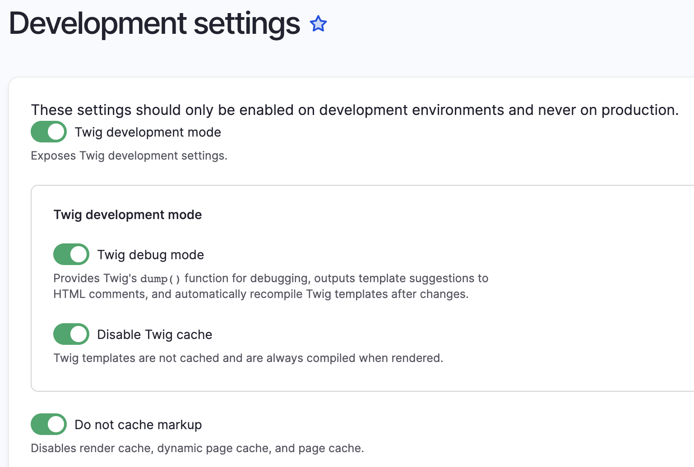

# Theming

Drupal relies on contributed and custom themes to tell it how to display page content. This section describes the custom Humber theme as well as custom tools used to create the theme, and information that helps to make changes in the future. 

## Humber Theme

The Humber Theme is a sub theme of Stable 9 and has been customized to meet Humber's web development guidelines. 

## Generating a New Theme using Starterkit

A new theme can be generated using the below script:

```
php core/scripts/drupal generate-theme theme-name
```

This generates a new theme in the `/themes` directory which can then be installed normally. 

## Using the Humber Theme in a Drupal Site

The Humber theme can be added into new Drupal sites as a [git subtree](developer-tools.md#git-subtree). You can find the repository for the theme [here](https://github.com/Humber-ITS/humber). The `README.md` file contains the instructions about how to add the theme to your project, pull, and push updates. 

The custom Humber theme should be placed into the `project-folder/web/themes` directory. 

## Development Mode

Not to be confused with [Development Environments](development-environments.md), Development mode is a number of settings which can be disabled or enabled to make development quicker and easier. **It is very important to only use these settings during development and never in production.** 

### Disable Caching

Disabling caching makes it possible to refresh the page and see CSS changes immediately. If this is not disabled, then you have to go to the admin menu and select Flush All Caches.

1. Go to **Admin -> Configuration -> Performance**
1. In the Caching section, select `<no caching>`

### Development Settings

Development settings contain options to enable Twig comments which output which templates are used to the page source. Additionally, you can disable Twig caching as well as several more development friendly options. 

1. Go to **Admin -> Configuration -> Development -> Development Settings** and toggle on all of the below options: 



### Disable Caching in Apache

In addition to the above settings, it is necessary to disable the caching of static assets such as CSS & JS within the server itself (Apache in our case).

## References

### API Reference

[API Reference](https://api.drupal.org/api/drupal/10) provides documentation generated from comments in Drupal Source Code and are an invaluable reference when coding themes or modules. 

#### Hooks

[Hooks](https://api.drupal.org/api/drupal/core%21core.api.php/group/hooks/10) provides documentation for various hooks from core code as well as built-in modules and can be used to override files and settings within these modules. 


## Tools

### Starterkit

In the past, Drupal themes were created manually by creating the required folders, configurations, and files. Today, it is a bit easier thanks to Starterkit. This tool is built into the latest versions of Drupal and uses a PHP script to generate a basic subtheme of [Stable 9](glossary.md#stable-9). 
